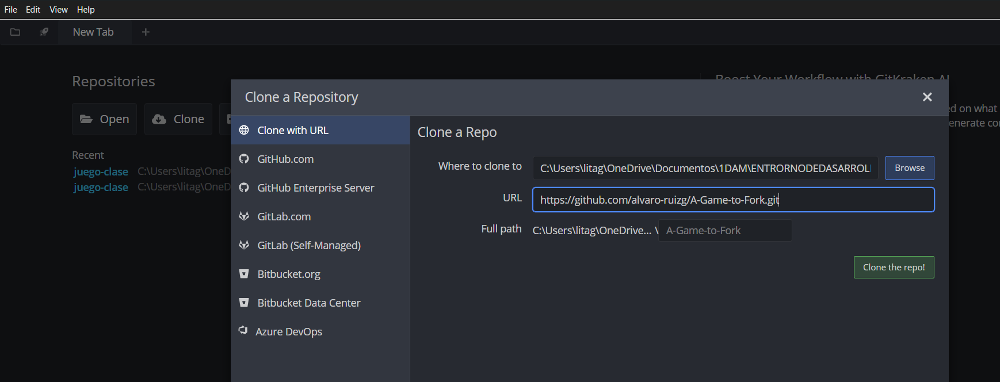
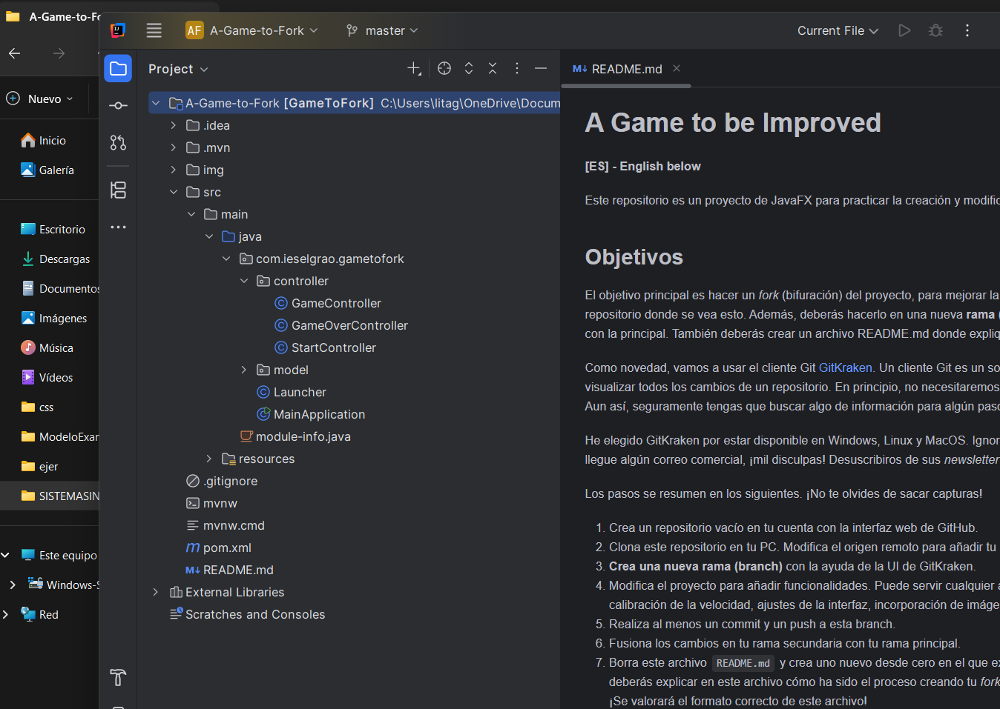
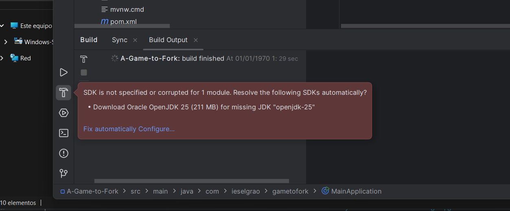
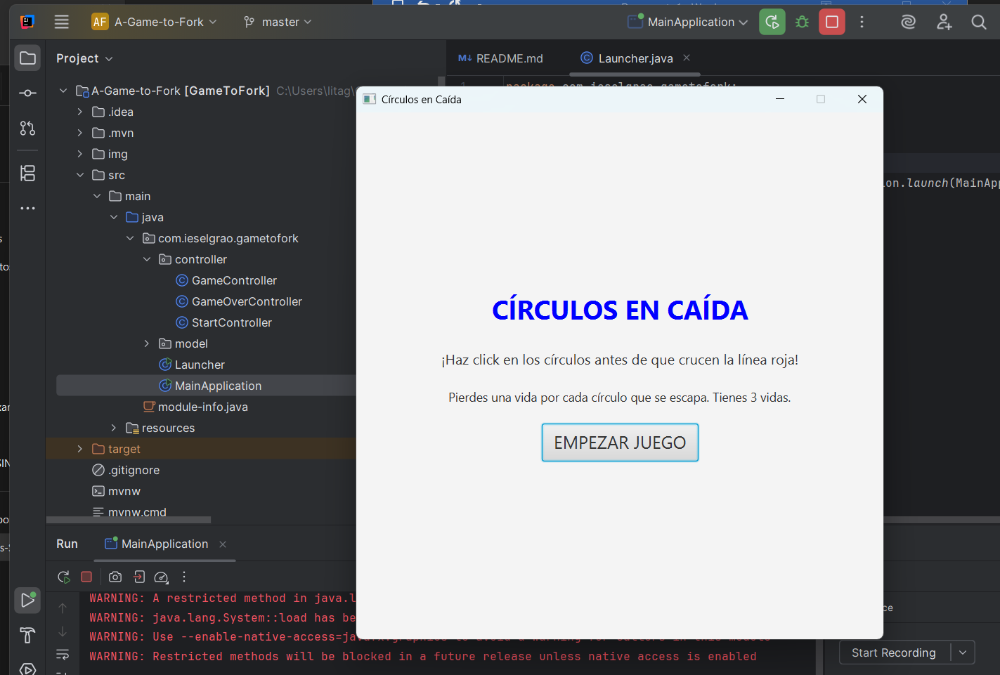
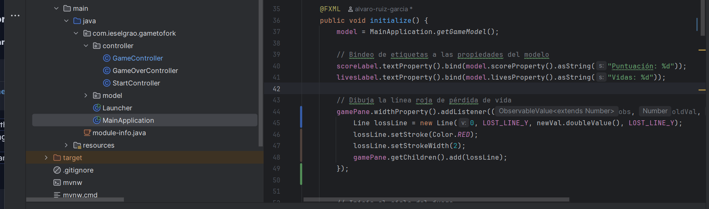
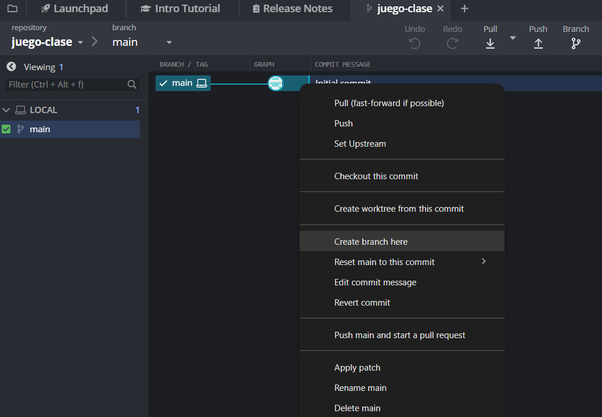
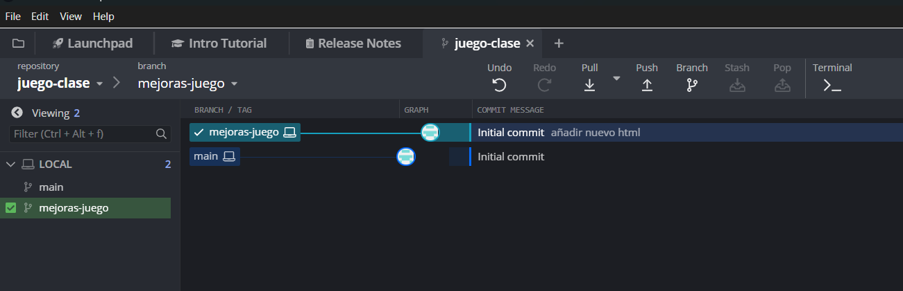
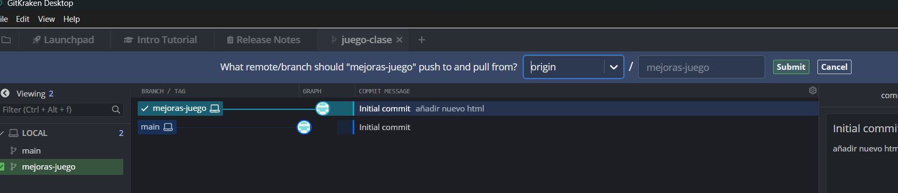

# Juego Clase – Guía paso a paso

## 📋 Menú de navegación
- [1. Crear repositorio en GitHub](#1-crear-un-repositorio-vacío-en-github)
- [2. Clonar el repositorio original](#2-clonar-el-repositorio-original-en-tu-pc)
- [7. Crea un rama secundaria](#7-crea un rama secundaria)
- [3. Modificar el repositorio clonado](#3-modifica-el-repositorio-clonado-del-profe-en-tu-pc)
- [4. Crear una nueva rama de desarrollo](#4-crear-una-nueva-rama-de-desarrollo)
- [5. Proyecto HTML](#5-proyecto-html)
- [6. Commit y Push](#6-commit-y-push)

---

## 1. Crear un repositorio vacío en GitHub
- Accede a GitHub y entra con tu cuenta.
- Haz clic en el botón "New" (nuevo repositorio).
- Nombre: `juego-clase`.
- Haz clic en "Create repository".

---

## 2. Clonar el repositorio original en tu PC
- Abre GitKraken.
- En el menú lateral, selecciona "Clone a repo".
- Introduce la URL del repositorio original del profe:  
  `https://github.com/alvaro-ruizg/A-Game-to-Fork.git`
- Elige una carpeta local donde se guardará el proyecto.
- Haz clic en "Clone the repo".

  

## 7. Crea un rama secundaria
- Boton derecho sobre el main crea rama secundaria
- Asegurate de estar trabajando sobre ella

---

## 3. Modifica el repositorio clonado del profe en tu PC
- Abre IntelliJ IDEA 2025.
- En el menú, selecciona "Abrir proyecto existente".
- Introduce la ruta local del repositorio que clonaste.

  
  
  
  
  
  

private final double LOST_LINE_Y = 500; 

1. La línea se dibuja antes de que PANE el  tenga tamaño
Line lossLine = new Line(0, LOST_LINE_Y, gamePane.getWidth(), LOST_LINE_Y);

  gamePane.getWidth() puede devolver 0  si el PANE aún no ha sido renderizado. Esto haría que la línea tenga longitud cero y no se vea.
. Usa gamePane.widthProperty() para escuchar cuando el  PANE tenga tamaño:

gamePane.widthProperty().addListener((obs, oldVal, newVal) -> {
    Line lossLine = new Line(0, LOST_LINE_Y, newVal.doubleValue(), LOST_LINE_Y);
    lossLine.setStroke(Color.RED);
    lossLine.setStrokeWidth(2);
    gamePane.getChildren().add(lossLine);
});

---

## 4. Crear una nueva rama de desarrollo
- En GitKraken, haz clic derecho sobre la rama principal (`main` o `master`).
- Selecciona "Create branch here".
- Nombra la nueva rama como `mejoras-juego` o similar.
- Asegúrate de estar en esa rama antes de hacer cambios.

  

---

## 5. Proyecto HTML
He creado un proyecto en HTML que consiste en un fichero `imagen.html` con una carpeta `img` que contiene una imagen `patatas.jpg`.

---

## 6. Commit y Push
- Vuelve a GitKraken.
- Verás los archivos modificados en la sección de cambios.
- Añade un mensaje descriptivo en el campo de commit (ej. "Mejoras del juego").
- Haz clic en "Commit changes".
- Luego pulsa "Push" para subir los cambios a tu rama en GitHub.

  
  
  
  
  
